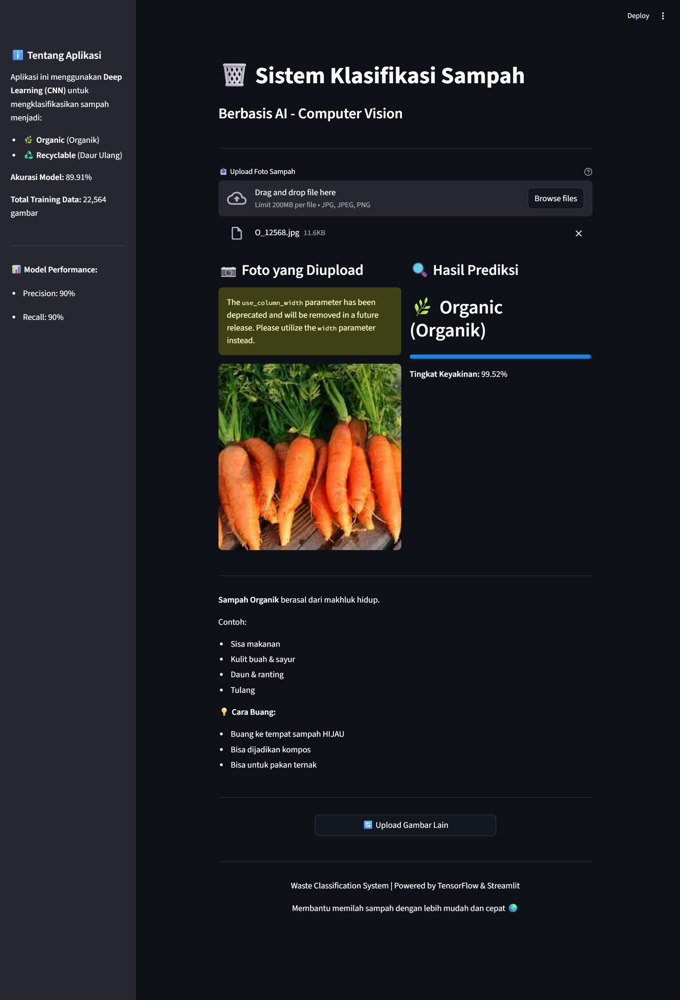

# 🗑️ Waste Classification System

AI-powered waste classification using Deep Learning (CNN) to classify waste into **Organic** and **Recyclable** categories.

## 🎯 Project Overview

- **Model Accuracy**: 89.91%
- **Training Data**: 22,564 images
- **Testing Data**: 2,527 images
- **Categories**: 2 (Organic & Recyclable)

## 🏗️ Tech Stack

- **Deep Learning**: TensorFlow/Keras
- **Model**: Custom CNN (9.8M parameters)
- **Frontend**: Streamlit
- **Training**: Google Colab (GPU)
- **Languages**: Python

## 📊 Model Performance

| Metric | Value |
|--------|-------|
| Accuracy | 89.91% |
| Precision | 90% |
| Recall | 90% |
| F1-Score | 90% |

## 🚀 How to Run

### Prerequisites
```bash
pip install tensorflow streamlit pillow opencv-python
```

### Run Application
```bash
streamlit run app.py
```

Open browser at `http://localhost:8501`

## 📁 Project Structure
```
project_sampah/
├── app.py                    # Streamlit web app
├── models/
│   └── best_model.keras      # Trained model
├── notebooks/
│   ├── explore_data.py
│   ├── data_generator.py
│   └── ... (preprocessing scripts)
└── dataset/
    ├── TRAIN/
    └── TEST/
```

## 🎓 Learning Journey

This project was completed in **3 phases**:

1. **Week 1-2**: Data preparation & preprocessing
2. **Week 3**: Model training (Google Colab GPU)
3. **Week 4**: Web deployment (Streamlit)

## 📸 Screenshots



## 👨‍💻 Author

**Farel** - Computer Vision Beginner Project

## 📄 License

This project is for educational purposes.
